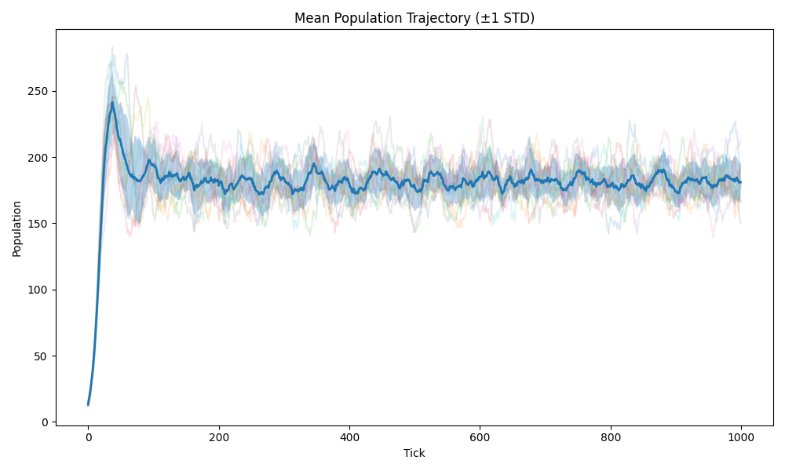
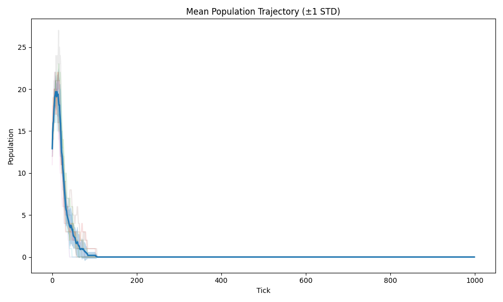
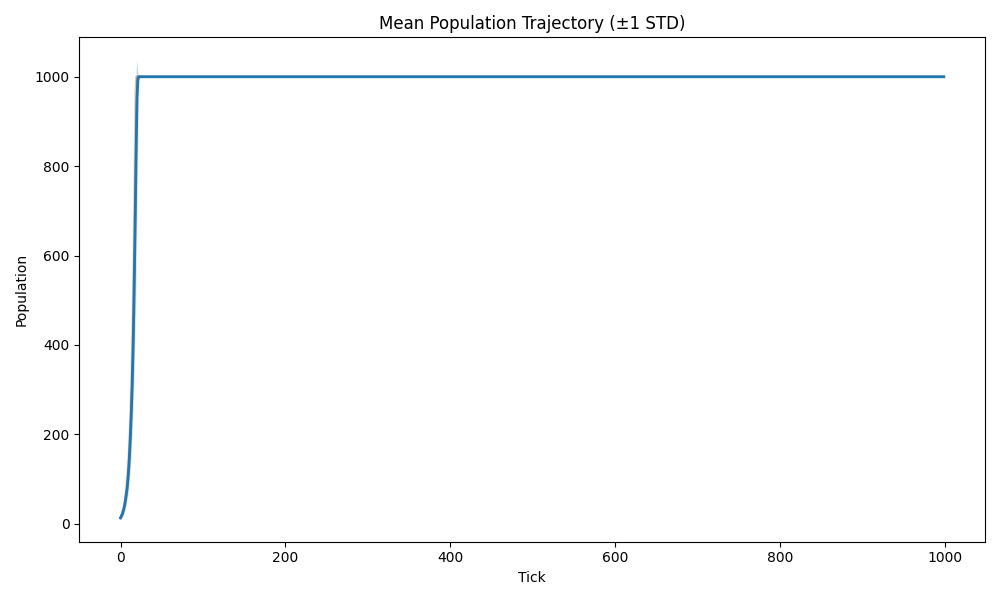

# Ecosystem Emergent Behavior Simulator

A deterministic multi-agent ecology simulator for running reproducible experiments on a wrapped 2D resource landscape.

$$S_{t+1} = T(S_t)$$

## Overview

The project has recently been refactored around a clearer execution pipeline:

`regime spec -> regime compiler -> runner -> engine -> metrics -> batch analytics`

That split is now visible in the package layout:

- `engine_build/regimes/` defines human-authored regime presets and compiles them into concrete runtime parameters.
- `engine_build/runner/` owns batch orchestration and seed spawning.
- `engine_build/core/` owns the deterministic simulation state and tick transitions.
- `engine_build/metrics/` records per-tick signals without embedding analysis logic into the engine.
- `engine_build/analytics/` derives tail-window fingerprints and batch summaries.
- `tests/` contains the current validation workflow in pytest.

## Current Capabilities

### Deterministic simulation core

- hierarchical RNG setup based on `SeedSequence`
- canonical state hashing
- snapshot -> restore -> continuation equivalence
- isolated stochastic domains for world, movement, reproduction, and energy initialization

### Ecological model

- wrapped 2D world compiled from regime anchors
- fertility/resource fields with bounded regeneration
- energy-gated movement, harvesting, reproduction, and death pathways
- built-in regime presets: `stable`, `extinction`, `saturated`

### Experiment and analysis workflow

- batched multi-run orchestration through `Runner`
- per-tick observability via `SimulationMetrics`
- aggregate regime fingerprints over the tail window of each run
- plotting utilities for experiment summaries and development inspection

### Validation coverage

- deterministic replay checks
- snapshot round-trip and restored-RNG checks
- structural invariants
- RNG isolation tests
- regime-level validation tests for `stable`, `extinction`, and `saturated`

## Quickstart

### Setup

```bash
git clone https://github.com/jul975/Poject_sim.git
cd Poject_sim
python -m venv .venv
```

Activate the environment:

Windows:

```bash
.venv\Scripts\activate
```

Linux/macOS:

```bash
source .venv/bin/activate
```

Install dependencies:

```bash
python -m pip install -r requirements.txt
```

## Running Experiments

Default experiment:

```bash
python -m engine_build.main --mode experiment --regime stable
```

Custom batch run:

```bash
python -m engine_build.main --mode experiment --regime stable --seed 42 --runs 10 --ticks 1000
```

Current experiment defaults live in `engine_build/execution/default.py` and are set to `10` runs over `1000` ticks.

Plot the population ensemble:

```bash
python -m engine_build.main --mode experiment --regime stable --runs 10 --ticks 1000 --plot
```

Open the more verbose development plots:

```bash
python -m engine_build.main --mode experiment --regime stable --runs 10 --ticks 1000 --plot_dev
```

Run the fertility exploration workflow:

```bash
python -m engine_build.main --mode experiment --fertility
```

The experiment CLI prints a batch summary that includes:

- final population mean and standard deviation
- extinction rate
- capacity-hit rate
- birth/death ratio
- time-series coefficient of variation over the tail window

## Running Validation

The validation path now lives in `tests/` and is driven through pytest.

Run the full suite:

```bash
python -m pytest
```

Run only the fast core checks:

```bash
python -m pytest -m dev
```

Run the broader validation set:

```bash
python -m pytest -m validate
```

Run selected validation domains:

```bash
python -m pytest tests/test_determinism.py
python -m pytest tests/test_snapshots.py
python -m pytest tests/test_rng_isolation.py
python -m pytest tests/test_regime_validation.py
```

Available markers in `pytest.ini`:

- `dev`
- `validate`
- `full`
- `slow`
- `rng`
- `invariant`
- `snapshot`
- `regime`

## Built-In Regimes

- `stable`: bounded population dynamics with low extinction pressure
- `extinction`: collapse-dominant dynamics driven by tighter energetic/resource constraints
- `saturated`: near-capacity occupancy with low extinction and frequent cap pressure

## Example Regimes

### Stable



### Extinction



### Saturated



## Repository Guide

- `engine_build/main.py`: experiment entry point
- `engine_build/execution/default.py`: default run counts, tick counts, and master seed
- `engine_build/regimes/`: regime presets, specs, and compiler
- `engine_build/runner/regime_runner.py`: batch orchestration and seed spawning
- `engine_build/core/`: engine, world, transitions, snapshots, and state schema
- `engine_build/metrics/`: per-run metrics collection
- `engine_build/analytics/`: fingerprints and batch-level analysis
- `engine_build/visualisation/`: experiment and development plotting helpers
- `tests/`: deterministic, snapshot, invariant, RNG-isolation, and regime validation suites

## Refactor Notes

Recent changes reflected in this README:

- validation has been moved into a dedicated pytest suite under `tests/`
- batch execution is now centered on `Runner` instead of ad hoc experiment loops
- regime handling is split into declarative specs plus a compiler step
- metrics collection and analytics/fingerprinting are separated from the engine core
- top-level experiment runs now expose plotting and fertility exploration flags through `engine_build.main`

## Documentation

For deeper design notes and model background, see:

- [Architecture](docs/canonical_docs/ARCHITECTURE.md)
- [Simulation Pipeline](docs/canonical_docs/SIMULATION_PIPELINE.md)
- [Mathematical Model](docs/canonical_docs/MATHEMATICAL_MODEL.md)
- [RNG Architecture](docs/canonical_docs/RNG_ARCHITECTURE.md)
- [Determinism](docs/canonical_docs/DETERMINISM.md)
- [Configuration](docs/canonical_docs/CONFIGURATION.md)
- [Experiments](docs/canonical_docs/EXPERIMENTS.md)
- [Agent Notes](docs/canonical_docs/Agent.md)

## Current Status

The current codebase is focused on:

- stabilizing the experiment/analytics pipeline
- preserving deterministic replay and snapshot guarantees
- expanding pytest-based validation coverage around regimes and invariants

## Design Principles

- determinism over convenience
- explicit entropy over hidden randomness
- invariants before features
- reproducibility before optimization

## Author

Jules Lowette
