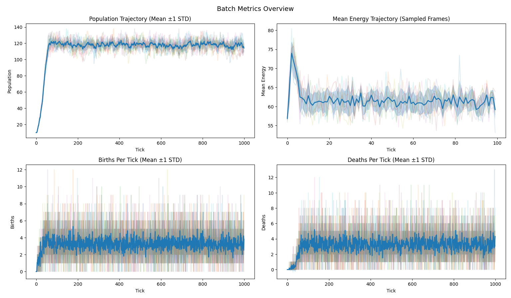
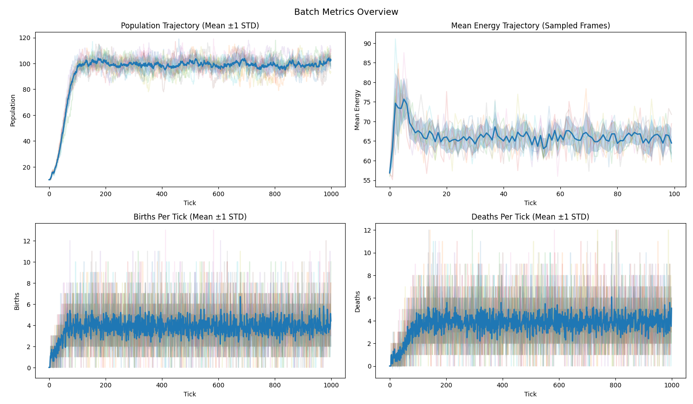
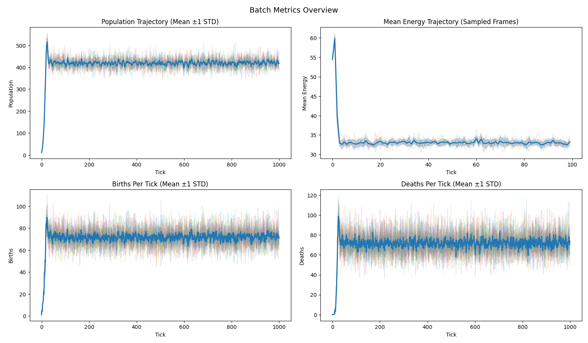
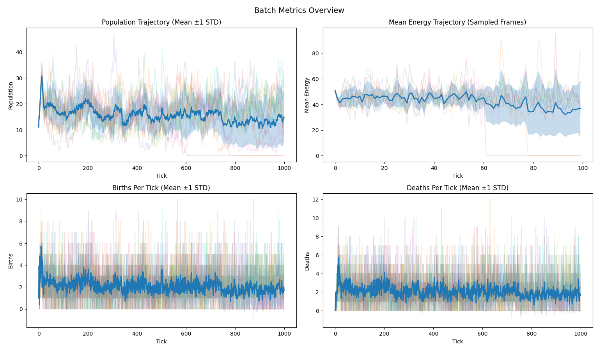
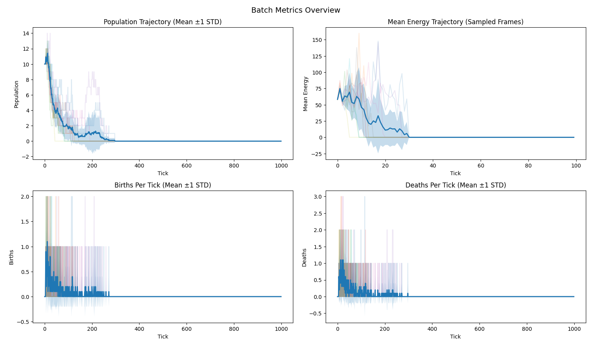

# Festina Lente

**Festina Lente** or "make haste slowly" was one of the favorite motto's of Caesar Augustus.

It's a reminder that in order to make progress, we need to take our time to build a solid foundation, in order to move forward more steadily. Keeping momentum without loosing scope and direction.

## Ecosystem Emergent Behavior Simulator

**Figure 1.** Emergent behavior in a flock of birds.


Emergent Behavior is the apparent result of simple rules being followed by individuals in a system, leading to complex and often unpredictable patterns at the level of the group.

Like a flock of birds flying together in a seemingly coordinated manner, even though each bird is only following simple rules of avoiding collisions and staying close to neighbors.

Every level of our complex world can be seen as a result of emergent behavior. From simple rules of physics, we get chemistry, from simple rules of chemistry we get biology, and from simple rules of biology we get behavior of animals, and so on...

Once you conceptualize this phenomenon, you'll start to see it everywhere. From the traffic patterns in cities, to the price of goods in the economy, to the behavior of people in social media.

This project tries to emulate such behavior in a simple ecosystem with two species, prey and predators. The goal is to study the behavior of the system and how it changes when we modify the rules of the game.

## Dynamic overview

<table align="center">
  <tr>
    <td align="center" width="48%">
      <strong>Figure 1.</strong> Place-holder stable dynamics visuals<br/>
      
    </td>
    <td align="center" width="48%">
      <strong>Figure 2.</strong> Place-holder collapse dynamics visuals<br/>
      
    </td>
  </tr>
</table>

In it's current state, the simulator creates a 2d world where each world field has a certain fertility level. The fertility level determines how much resources the resource field can regenerate each turn.

Each tick, the agents move, harvest resources, reproduce and/or dies. Agents have a certain energy level, . The energy level is depleted each turn and is replenished by harvesting resources. If the energy level reaches zero, the agent dies.

## Conceptual view

Deterministic multi-agent ecology simulator for reproducible experiments on a 2D toroidal resource landscape.

The simulator is a **discrete-time stochastic state-transition system**.

At each tick, it takes the current global state, applies a fixed update schedule, consumes controlled randomness, and produces the next state.

$$S_{t+1} = F(S_t, \xi_t; \theta)$$

Where:

- $S_t$ = full simulator state at time $t$
- $\xi_t$ = stochastic input at tick $t$
- $\theta$ = parameter set / regime configuration
- $F$ = simulator transition operator

---

The system runs for a given amount of 'ticks', where each tick represents a unit of time or 'change', controlled and orchestrated by the engine.

The engine makes a 'step' in time for each tick. Where a step can be formalized as the Transition operator T.

The T operator takes the current state of the system and applies a set of rules to determine the next state. The rules are applied in a specific order, which is defined by the engine. The order is as follows:

1. Movement Phase

    - Agents die of old age.
    - Agents move to a neighboring cell.
    - Agents pay the metabolic cost of movement.
    - if agent energy level <= 0, agent dies of metabolic starvation.

2. Interaction Phase

    - Spatial index is updated.
    - Agents harvest resources from local field, sharing the harvest according to the number of agents in the local field.
    - Agents die of starvation if they don't have enough energy.

3. Biology Phase

    - Agents reproduce with a certain probability.
    - if agent energy level <= 0, agent dies of reproduction.
    - Agents age.

4. Commit phase

    - Births are committed.
    - Deaths are committed.
    - Resources regrow according to fertility.

The T operator is deterministic, meaning that given the same initial state, it will always produce the same output. This is achieved by using a pseudo-random number generator (PRNG) that is initialized with a seed value. The seed value is the only source of randomness in the system.

## Current state

As of March 23, 2026, the repository is at package version `0.3.0a0` and represents the current pre-Stage III / pre-`v0.3` freeze candidate. The 2D engine transition is live, determinism is still a hard constraint, and the main public surface is a small CLI for experiments plus suite-based verification and validation.

## Pre-Stage III Freeze Snapshot

- 2D toroidal world with 2D fertility and resource fields
- deterministic execution with canonical state hashing
- snapshot and restore support with continuation-equivalent behavior
- isolated RNG ownership across world, movement, reproduction, and energy
- phase-structured engine loop: movement -> interaction -> biology -> commit
- batch runner plus per-run and batch-level analytics
- optional plotting, performance profiling, and world-frame capture
- CLI lanes for `experiment`, `verify`, and `validate`
- explicit interactive menu entrypoint via `python -m engine_build.main menu`

Checked on March 23, 2026 in the project `.venv`:

- `tests/verification`: `25 passed`
- `tests/validation`: `6 passed`

## What This Version Is Not Yet

- explicit Stage III crowding, collision, and local-competition rules are not implemented yet
- spatial diagnostics exist, but the current 2D analytics surface is still lighter than the planned Stage III metrics stack
- the CLI is usable but still intentionally small and pre-freeze
- plotting dependencies are imported during CLI startup, so dependencies should be installed before running any CLI command, including `--help`

## Current Regimes

The live regime registry is:

- `stable`

    

- `fragile`

    

- `abundant`

    

- `saturated`

    

- `collapse`

    

- `extinction`

    

Current defaults from `engine_build/execution/default.py`:

- `DEFAULT_MASTER_SEED = 20250302`
- experiment defaults: `runs = 10`, `ticks = 1000`
- experiment tail window default: `--tail-fraction 0.25`

## Quickstart

```bash
git clone https://github.com/jul975/FestinaLente.git
cd FestinaLente
python -m venv .venv
```

Windows:

```bash
.venv\Scripts\activate
```

Linux or macOS:

```bash
source .venv/bin/activate
```

Install dependencies before running the CLI:

```bash
python -m pip install -r requirements.txt
```

Python requirement from `pyproject.toml`: `>=3.11`

## Running Experiments

Baseline run:

```bash
python -m engine_build.main experiment --regime stable
```

Custom run:

```bash
python -m engine_build.main experiment --regime stable --seed 42 --runs 5 --ticks 500
```

Batch plots:

```bash
python -m engine_build.main experiment --regime stable --plot
```

Performance profiling:

```bash
python -m engine_build.main experiment --regime abundant --runs 10 --ticks 1000 --perf-flag
```

World-frame capture plus dev plots:

```bash
python -m engine_build.main experiment --regime stable --runs 3 --ticks 200 --world-frame-flag --plot-dev
```

Interactive menu:

```bash
python -m engine_build.main menu
```

## Verification And Validation

Verification suites:

- `all`
- `determinism`
- `invariants`
- `rng`
- `snapshots`

Validation suites:

- `all`
- `contracts`
- `separation`

Run via the project CLI:

```bash
python -m engine_build.main verify --suite all
python -m engine_build.main validate --suite all
```

Direct pytest entry points:

```bash
python -m pytest tests/verification
python -m pytest tests/validation
```

Useful markers from `pytest.ini`:

- `dev`
- `validate`
- `verify`
- `regime`
- `full`
- `slow`
- `rng`
- `invariant`
- `snapshot`

## Repository Map

- `engine_build/core/` - engine, world, transitions, snapshots, canonical state schema
- `engine_build/regimes/` - regime specs, compiled params, registry, compiler
- `engine_build/runner/` - batch orchestration and run lifecycle
- `engine_build/metrics/` - per-tick metrics collection
- `engine_build/analytics/` - fingerprints, summaries, classification, world-frame analytics
- `engine_build/experiments/` - experiment-mode entrypoints and output formatting
- `engine_build/cli/` - parser, requests, dispatch, and menu frontend
- `engine_build/visualisation/` - batch plots, single-run plots, world-view plots
- `tests/verification/` - determinism, invariants, snapshots, RNG isolation, CLI smoke
- `tests/validation/` - regime contracts and regime separation checks
- `docs/canonical_docs/` - architecture and behavior references
- `docs/Project_Status/` - roadmap, current status, performance notes

## Documentation

- [Architecture](docs/canonical_docs/ARCHITECTURE.md)
- [Simulation Pipeline](docs/canonical_docs/SIMULATION_PIPELINE.md)
- [Mathematical Model](docs/canonical_docs/MATHEMATICAL_MODEL.md)
- [Configuration](docs/canonical_docs/CONFIGURATION.md)
- [Determinism](docs/canonical_docs/DETERMINISM.md)
- [RNG Architecture](docs/canonical_docs/RNG_ARCHITECTURE.md)
- [Experiments](docs/canonical_docs/EXPERIMENTS.md)
- [Current State](docs/Project_Status/CURRENT_STATE.md)
- [Roadmap](docs/Project_Status/ROADMAP.md)

## Near-Term Priorities

- keep the current verification and validation surface green while freezing docs and CLI behavior
- expand 2D-aware spatial diagnostics on top of the existing world-frame analytics
- document Stage III interaction rules before implementing them
- freeze a clean pre-Stage III baseline that matches code, tests, and docs
